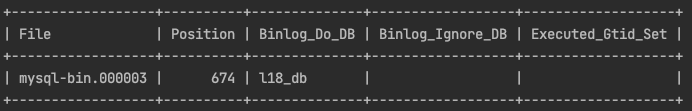
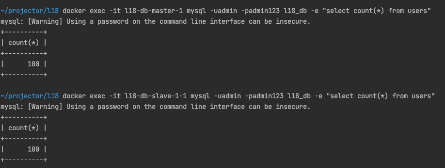
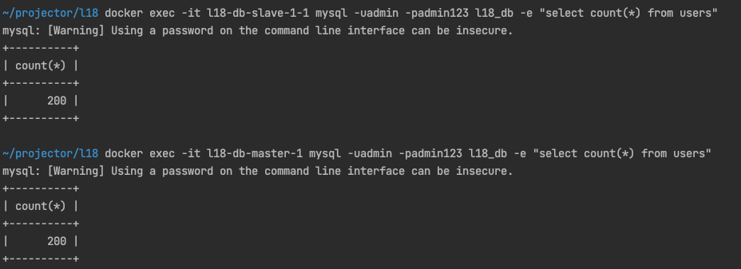
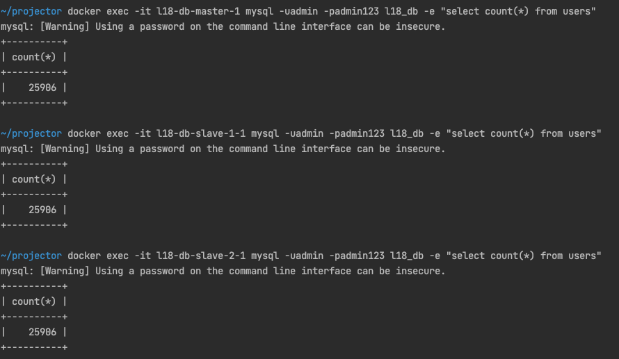
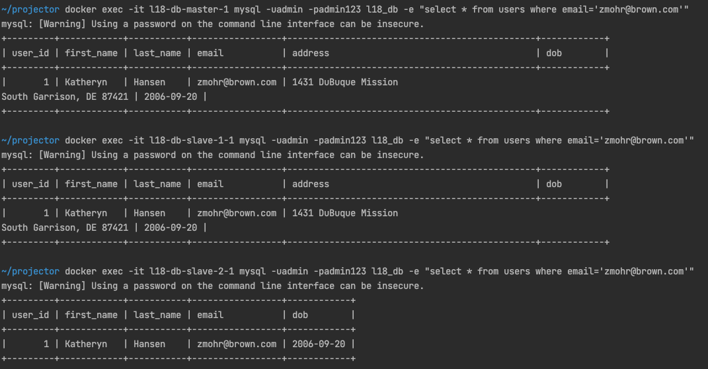

# Database Replication

Run ```docker-compose up -d``` to start containers. 
Run ```bash init.sh``` to create user and grant permissions. Also this script will output the master status. 



Run ```bash replications.sh mysql-bin.000003 674``` script adding bin log filename and position as arguments. 

Calling ```docker exec -it l18-php-1 php index.php``` will add 100 records to the database. 

### Tests: 

#### First run 
Added 100 records. Checked the number of records in master and slave nodes. 



#### Second run: 



#### Disabled slave1

Script to run insert records in a loop ```bash test.sh```. Ran the script, disabled slave 1, when reenabled the number of records equals. 



#### Removed column in slave1

Removed address colun from the slave 2
```shell
docker exec -it l18-db-slave-2-1 mysql -uadmin -padmin123 l18_db -e "ALTER TABLE Users DROP COLUMN address;"
```



This lead to an error and stopping of the slave

> Column 4 of table 'l18_db.users' cannot be converted from type 'varchar(1020(bytes))' to type 'date', Error_code: MY-013146

Solution seems to be top recreate database, import fresh database dump from master and restart slave. 